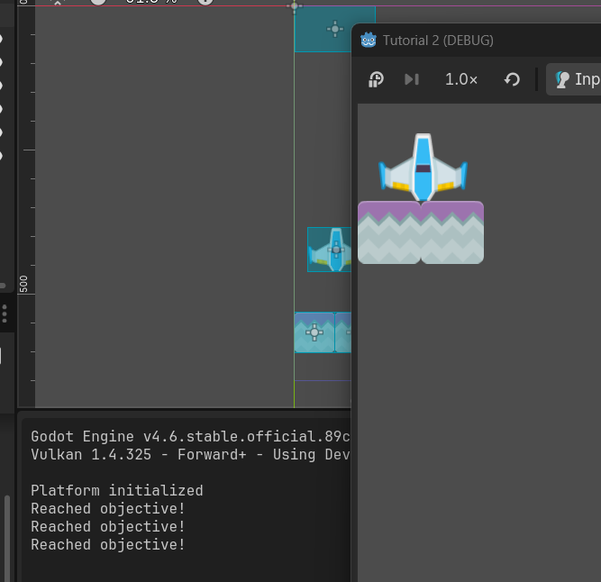

## Latihan: Playtest

#### 1. Apa saja pesan log yang dicetak pada panel Output?

Pada awal inisialisasi game, terdapat pesan "Platform initialized" yang memang dicetak jika game dimulai. Setelah pesawat mencapai area di dekat batas atas, terdapat pesan "Reached objective!".



#### 2. Coba gerakkan landasan ke batas area bawah, lalu gerakkan kembali ke atas hingga hampir menyentuh batas atas. Apa saja pesan log yang dicetak pada panel Output?

Sama saja, pesan yang dicetak hanya "Reached objective!" jika sudah mencapai area di sekitar batas atas. Saat pesawat ada di batas bawah, tidak ada pesan yang dicetak.

#### 3. Buka scene MainLevel dengan tampilan workspace 2D. Apakah lokasi scene ObjectiveArea memiliki kaitan dengan pesan log yang dicetak pada panel Output pada percobaan sebelumnya?

Ya, scene `ObjectiveArea` ini adalah yang menjadi detector objek pesawat jika ia ada di area di dekat batas atas. Pada `ObjectiveArea` terdapat script:

```gd
func _on_ObjectiveArea_body_entered(body: RigidBody2D):
	if (body.name == "BlueShip"):
		print("Reached objective!")
```

yang mendeteksi objek dengan nama "BlueShip", yaitu pesawat kita. Pada saat objek pesawat masuk ke dalam area ini, maka tercetak pesan "Reached objective!" seperti yang bisa dilihat di section Output.


## Latihan: Memanipulasi Node dan Scene

#### 1. Scene BlueShip dan StonePlatform sama-sama memiliki sebuah child node bertipe Sprite2D. Apa fungsi dari node bertipe Sprite2D?

Sprite2D adalah node yang bisa melengkapi suatu node untuk memiliki bentuk secara visual, terutama dalam bentuk 2 dimensi. Misalnya pada BlueShip, ia memiliki texture bergambar pesawat 2D yang diambil dari gambar yang ada di folder `assets`.

#### 2. Root node dari scene BlueShip dan StonePlatform menggunakan tipe yang berbeda. BlueShip menggunakan tipe RigidBody2D, sedangkan StonePlatform menggunakan tipe StaticBody2D. Apa perbedaan dari masing-masing tipe node?

Keduanya memiliki perbedaan di physics law yang bisa terjadi ke mereka.
- **StaticBody2D** bersifat statis, tidak bereaksi pada collision dan gravitasi. Scene dengan node ini tetap bisa digerakkan, tapi bukan secara fisika (dengan kata lain, seperti berpindah secara teleport ke satu tempat ke tempat lainnya)

- **RigidBody2D** mengimplementasikan efek fisika secara penuh, ada gaya akibat benturan atau tarikan gravitasi. Secara otomatis scene dengan node ini akan menghitung efek physics yang terjadi di scene, seperti gerakan, collision effect, dan arah mantul.

#### 3. Ubah nilai atribut Mass pada tipe RigidBody2D secara bebas di scene BlueShip, lalu coba jalankan scene MainLevel. Apa yang terjadi?

Tidak begitu berubah walaupun menjadi sangat ringan ataupun sangat berat. Kemungkinan ini terjadi karena sifat StaticBody2D pada scene PlatformBlue yang tidak menghitung collision dengan pesawat, sehingga tidak terlihat beratnya bertambah/berkurang

#### 4. Ubah nilai atribut Disabled milik node CollisionShape2D pada scene StonePlatform, lalu coba jalankan scene MainLevel. Apa yang terjadi?

Saat CollisionShape2D pada scene StonePlatform dibuat True, maka StonePlatform tidak akan bisa memberikan efek collision lagi. Hal ini berarti scene seperti BlueShip yang memiliki node RigidBody2D tidak akan bisa mengkalkulasikan efek benturan dengan scene ini, sehingga saat dijalankan ia menembus platform yang menopangnya.

#### 5. Pada scene MainLevel, coba manipulasi atribut Position, Rotation, dan Scale milik node BlueShip secara bebas. Apa yang terjadi pada visualisasi BlueShip di Viewport?

Setelah dimanipulasi, posisi (jika mengubah Position/Rotation) atau ukuran (jika mengubah Scale) dari BlueShip akan berubah juga di Viewport nya MainLevel. Walaupun begitu, konfigurasi di viewport BlueShip itu sendiri tidak akan berubah, karena BlueShip di MainLevel itu adalah instance dari penggunaan scene BlueShip itu sendiri.

#### 6. Pada scene MainLevel, perhatikan nilai atribut Position node PlatformBlue, StonePlatform, dan StonePlatform2. Mengapa nilai Position node StonePlatform dan StonePlatform2 tidak sesuai dengan posisinya di dalam scene (menurut Inspector) namun visualisasinya berada di posisi yang tepat?

Nilai position dari PlatformBlue adalah koordinat posisinya yang ada di scene MainLevel, sedangkan nilai position dari StonePlatform adalah posisinya di dalam scene PlatformBlue, bukan dari positionnya di MainLevel. Karena StonePlatform dan StonePlatform2 adalah child dari BluePlatform, maka ia mengikuti sistem koordinat yang ada di dalam scene parent nya secara direct.